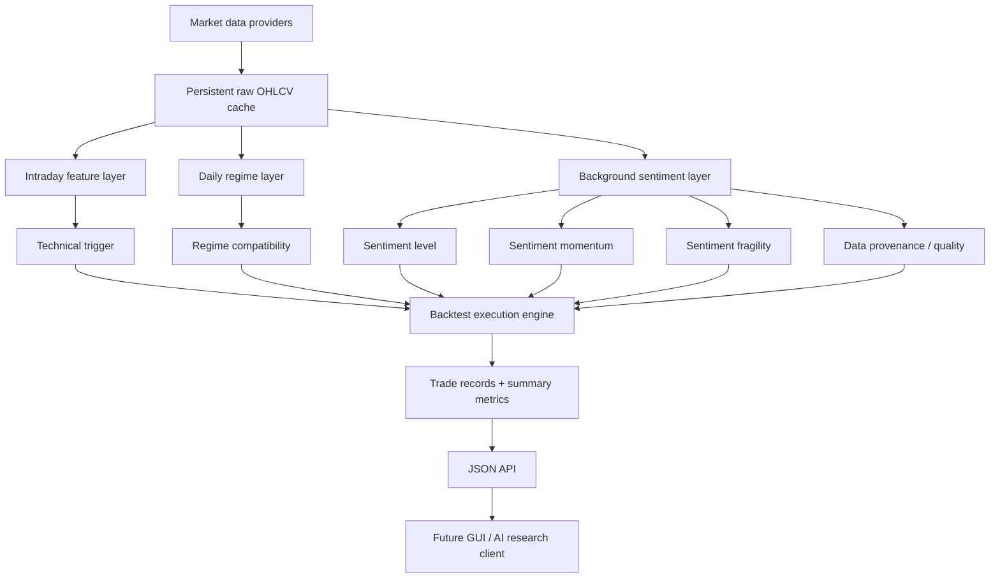

# BKTSTR System Manual

**Release:** v0.3.3  
**Purpose:** architecture reference, research-methodology white paper, API/user manual, and future GUI implementation guide.

BKTSTR is a read-only historical market-research service. It separates slow background context from intermediate market regime and fast technical entries so that each layer can be tested independently and combined without hiding assumptions. It never places brokerage orders.

## System schematic



The intended hierarchy is:

1. **Background sentiment** — What does the market appear to believe about the asset over weeks to months?
2. **Sentiment transition/fragility** — Is that belief coherent and stable, or is it beginning to break?
3. **Regime** — Is the current daily market environment favorable to this kind of trade?
4. **Technical signal** — Is there a specific intraday entry now?
5. **Execution model** — What would have happened under explicit fills, slippage, stops, targets, and time limits?

No layer should silently substitute for another. A strong technical setup can exist inside a hostile sentiment background; the system should expose that disagreement rather than erase it.

## Core execution model

BKTSTR evaluates entry rules on a completed bar and enters on the **next bar open**. This prevents same-bar-close look-ahead. Long and short underlying-equity trades are supported. Slippage is applied adversely. If both stop and target are touched within the same OHLC bar, BKTSTR assumes the stop was hit first, which is deliberately conservative.

By default, indicators and trades use regular US equity hours. Session VWAP resets each trading session. Cross rules are session-bounded so the first bar of a new session cannot create a synthetic cross against the previous day's last bar.

The current aggregate max-drawdown statistic is based on closed-trade equity rather than minute-by-minute mark-to-market equity. MFE and MAE are recorded per trade.

## Layer definitions

### Technical layer

The intraday layer currently provides session VWAP, RSI(14), and a rolling 20-bar volume ratio. Rules use a compact `field.operator:value` syntax and comma-separated rules are ANDed.

Examples:

```text
close.cross_below:vwap
rsi14.lt:50
volume_ratio20.gt:1.1
```

A typical short discovery trigger is:

```text
close.cross_below:vwap,rsi14.lt:50,volume_ratio20.gt:1.1
```

### Daily regime layer

The regime layer is an intermediate-timescale filter. It uses completed daily data and can compare the subject with a benchmark.

Current fields include:

- `day_close`
- `day_sma20`
- `day_sma50`
- `day_sma20_slope5`
- `day_return20`
- `benchmark_return20`
- `relative_return20`

Example:

```text
regime=day_sma20_slope5.lt:0,relative_return20.lt:0
benchmark=SOXX
```

Regime rules are hard filters: if the regime condition is false, the technical setup cannot open a trade.

### Native sentiment filters — v0.3.3

Sentiment outputs may also be referenced directly in the same `regime=` rule string when `sentiment=true`. This keeps sentiment as a separate calculated layer while allowing it to gate a technical setup without external SQL post-processing.

Example:

```text
regime=day_sma20_slope5.lt:0,relative_return20.lt:0,sentiment_fragility.gte:0.35
benchmark=SOXX
sentiment=true
sentiment_sector_benchmark=SOXX
sentiment_market_benchmark=QQQ
```

Filterable sentiment fields are `sentiment_direction`, `sentiment_confidence`, `sentiment_momentum20`, `sentiment_momentum60`, `sentiment_momentum`, `sentiment_component_spread`, `sentiment_volatility_stress`, and `sentiment_fragility`. Cross operators remain disallowed for regime filters.

## Sentiment layer definitions

The sentiment layer is **price-implied background investor sentiment**, not a direct survey of investor opinions. In v0.3.2 the only active source is clean historical market price data. The layer uses daily OHLCV from the subject, a sector benchmark, and a broad-market benchmark.

For an NVDA study the normal mapping is:

```text
subject = NVDA
sector benchmark = SOXX
market benchmark = QQQ
```

The sentiment layer intentionally exposes three separate state variables:

- `sentiment_direction`: established background sentiment level, -1 bearish to +1 bullish.
- `sentiment_momentum`: direction in which that sentiment level is changing, -1 deteriorating to +1 improving.
- `sentiment_fragility`: instability/contradiction in the sentiment state, 0 coherent to 1 highly fragile.

This separation is important. A stock can remain structurally bullish while its leadership collapses and volatility expands. Averaging those observations into a single neutral number would hide a potentially important narrative transition.

### 1. Leadership component

**Weight in sentiment level: 35%.**

Leadership compares subject returns with both the sector and market over approximately three and six trading months:

```text
relative_return63_sector  = subject_return63  - sector_return63
relative_return126_sector = subject_return126 - sector_return126
relative_return63_market  = subject_return63  - market_return63
relative_return126_market = subject_return126 - market_return126
```

Each relative-return series is smoothly compressed to -1..+1 with a hyperbolic tangent transform. The 63-session series uses a 10 percentage-point scale and the 126-session series uses a 20 percentage-point scale. The four transformed values are averaged into `sentiment_leadership_score`.

Interpretation:

- Near +1: persistent leadership/outperformance.
- Near 0: broadly keeping pace.
- Near -1: persistent loss of leadership.

### 2. Trend component

**Weight in sentiment level: 30%.**

To preserve comparability with v0.3.1, v0.3.2 keeps the established slow-trend definition. It calculates 50-, 100-, and 200-session simple moving averages and measures each one's percentage change over 20 completed sessions:

```text
sma50_slope20
sma100_slope20
sma200_slope20
```

Those slopes are compressed to -1..+1 and averaged into `sentiment_trend_score`.

EMA values are now also exposed (`ema50`, `ema100`, `ema200`) for persistence/transition analysis, but v0.3.2 does not simultaneously replace the legacy trend formula. This isolates the persistence change for cleaner research comparison.

### 3. Peak-psychology component

**Weight in sentiment level: 20%.**

`distance_from_52w_high` measures the subject close against the highest close in the previous 252 sessions. The component maps approximately as follows:

| Distance from 252-session high | `sentiment_peak_score` |
| ---: | ---: |
| 0% | +1.00 |
| -5% | +0.75 |
| -10% | +0.50 |
| -20% | 0.00 |
| -30% | -0.50 |
| -40% or lower | -1.00 |

The intent is behavioral: persistent proximity to records often reinforces a winner narrative, while a large sustained drawdown can weaken that narrative.

### 4. Persistence component — v0.3.2

**Weight in sentiment level: 15%.**

v0.3.1 counted how many of the previous 20 sessions closed below SMA50. That field (`days_below_sma50`) remains available as a diagnostic, but it no longer drives the persistence component.

v0.3.2 uses two exponentially weighted measurements over a 40-session span.

#### Persistence occupancy

First define whether the subject is below EMA50:

```text
below_ema50 = 1 when close < EMA50, otherwise 0
```

Then calculate:

```text
persistence_occupancy = EWMA(below_ema50, span=40)
```

Range is 0..1. A high value means recent history has repeatedly spent time below the responsive trend anchor.

The directional occupancy score is:

```text
occupancy_score = 1 - 2 * persistence_occupancy
```

So 0% occupancy maps to +1 and 100% occupancy maps to -1.

#### Persistence pressure

BKTSTR computes 20-session Average True Range from daily high/low/close data and normalizes distance from EMA50 by volatility:

```text
normalized_ema50_distance = (close - EMA50) / ATR20
```

This matters because being $3 below an EMA is significant in a calm stock and less significant in a highly volatile stock.

That normalized distance is exponentially smoothed:

```text
persistence_pressure_raw = EWMA(normalized_ema50_distance, span=40)
pressure_score = tanh(persistence_pressure_raw)
```

Finally:

```text
sentiment_persistence_score = mean(occupancy_score, pressure_score)
```

This captures both **how persistently** price is below trend and **how far** below trend it tends to be, while adjusting for volatility.

### Sentiment level

The four component scores are combined using:

```text
leadership  35%
trend       30%
peak        20%
persistence 15%
```

The weighted mean over available components is `sentiment_direction` in the range -1..+1.

`sentiment_completeness` equals the sum of available component weights. Missing long-history features reduce completeness instead of being silently imputed.

`sentiment_confidence` incorporates completeness, absolute component magnitude, and absolute sentiment direction. Low agreement among strong components can therefore produce low confidence even when each input is individually large.

### Informational multipliers

For research, BKTSTR exposes symmetric bounded multipliers:

```text
adjustment = 0.5 * sentiment_direction * sentiment_confidence
sentiment_multiplier_long  = clip(1 + adjustment, 0.5, 1.5)
sentiment_multiplier_short = clip(1 - adjustment, 0.5, 1.5)
```

**These do not change position size in v0.3.2.** They are metadata only. Position sizing should not be altered until the layer proves predictive out of sample.

## Sentiment momentum

Momentum measures the change in the sentiment level itself:

```text
sentiment_momentum20 = clip(direction_today - direction_20_sessions_ago, -1, +1)
sentiment_momentum60 = clip(direction_today - direction_60_sessions_ago, -1, +1)
```

The combined score is:

```text
sentiment_momentum = 65% * momentum20 + 35% * momentum60
```

Weights are renormalized if one lookback is unavailable.

Interpretation:

- Positive: sentiment is improving.
- Near zero: sentiment level is stable.
- Negative: sentiment is deteriorating.

Momentum is intentionally separate from level. A strongly bullish asset can have sharply negative sentiment momentum during an early narrative break.

## Sentiment fragility

Fragility is **non-directional** and ranges from 0 to 1. High fragility means the sentiment state is internally contradictory, changing rapidly, experiencing volatility expansion, or some combination of those conditions.

### Component spread — 50% of fragility

`sentiment_component_spread` is the weighted standard deviation of the four sentiment components around the weighted `sentiment_direction`, clipped to 0..1.

Low spread means leadership, trend, peak psychology, and persistence broadly agree. High spread means the story is internally fractured.

### Volatility stress — 30% of fragility

BKTSTR exposes:

- `atr20_pct`: ATR20 divided by close, percent.
- `realized_vol20`: annualized standard deviation of daily returns over 20 sessions.
- `realized_vol60`: annualized standard deviation over 60 sessions.
- `volatility_ratio`: realized_vol20 / realized_vol60.

Two expansion measures are used:

```text
vol_ratio_stress = clip((volatility_ratio - 1) / 0.75, 0, 1)
atr_stress = clip((atr20_pct / median60(atr20_pct) - 1) / 0.75, 0, 1)
```

Their available-value mean is `sentiment_volatility_stress`.

A value near zero means short-horizon volatility is not elevated relative to its recent baseline. A value near one means volatility has expanded substantially.

### Transition speed — 20% of fragility

The third fragility ingredient is `abs(sentiment_momentum20)`. A rapid change in either direction can make the prevailing sentiment state less stable.

Final formula:

```text
sentiment_fragility =
    50% * component_spread
  + 30% * volatility_stress
  + 20% * abs(momentum20)
```

Available inputs are renormalized and the result is clipped to 0..1.

Fragility must never be interpreted as automatically bearish. High fragility plus bearish momentum and a bearish regime can strengthen a short thesis; high fragility plus improving momentum and bullish confirmation can describe an upside transition.

## Data provenance and quality tiers

The provenance system is designed to prevent lower-confidence data from entering a backtest invisibly.

| Tier | Label | Definition | v0.3.2 status |
| --- | --- | --- | --- |
| A | Clean | Objective point-in-time market data with deterministic transforms | **Enabled** |
| B | Structured | Reliable structured data requiring interpretation/revision discipline | Not yet enabled |
| C | Derived | Model-transformed narrative/text data | Not yet enabled |
| D | Experimental | Esoteric, low-confidence, or difficult-to-reconstruct data | Not yet enabled |

The source registry already reserves future source IDs:

- `price` — Tier A, available now.
- `options` — Tier B, unavailable in v0.3.2.
- `analyst` — Tier B, unavailable.
- `macro` — Tier B, unavailable.
- `news` — Tier C, unavailable/model-derived.
- `social` — Tier D, unavailable/model-derived and not currently marked point-in-time safe.

### Profiles and toggles

The v0.3.2 sentiment request accepts:

```text
sentiment_data_profile=clean
sentiment_sources=price
```

`clean` is the default and currently the only available profile. If a request asks for an unavailable source, the request fails explicitly. BKTSTR will not replace the missing source with another source and will not silently promote a lower-quality tier.

Every sentiment-enabled response includes provenance metadata such as:

```json
{
  "profile": "clean",
  "non_clean_data_used": false,
  "all_point_in_time_safe": true,
  "sources": [
    {
      "id": "price",
      "tier": "A",
      "point_in_time_safe": true,
      "model_derived": false,
      "available": true
    }
  ]
}
```

A future GUI should surface `non_clean_data_used` prominently whenever it becomes true.


## Sentiment history coverage

v0.3.3 treats pre-period sentiment history as **optional warm-up** while keeping the requested backtest period strict. BKTSTR first requests the full 460-calendar-day sentiment warm-up. If the provider rejects only that older prefix, BKTSTR fetches the requested backtest period normally, preserves any older daily history already present in the persistent cache, and continues with reduced sentiment completeness rather than failing the whole backtest.

A failure while fetching required-period daily data is still fatal. The system does not silently reinterpret a required-data outage as missing warm-up.

Every sentiment response reports:

- `requested_warmup_start`: desired historical start for full sentiment context.
- `coverage_start`: latest first available date across subject, sector benchmark, and market benchmark; this is the common usable start.
- `coverage_end`: earliest last available date across those three series.
- `warmup_degraded`: true when optional history had to fall back or common coverage could not be established.
- `coverage.subject`, `coverage.sector`, `coverage.market`: per-source requested start, required start, actual coverage dates, fallback flag, daily bar count, and cache stats.

The GUI should visibly warn when `warmup_degraded=true`, display the actual coverage range, and continue to show `sentiment_completeness` on individual trades.

## Look-ahead safety

Look-ahead safety is a hard requirement, not an optional display property.

For an intraday trading session on date D, BKTSTR attaches the latest completed sentiment row whose daily date is **strictly earlier than D**. Therefore a Tuesday intraday trade can use Monday's completed daily data but never Tuesday's eventual close/high/low.

Momentum, persistence, volatility, and fragility are all computed within the historical daily series before this strict prior-day attachment occurs.

Non-price sources added in the future must also be point-in-time reconstructable. For revision-prone macro or analyst data, the system should use the value actually published and known on the historical date, not a later revised value.

## API examples

### Sentiment only

```text
GET /api/v1/backtest?
symbol=NVDA&
start=2026-06-01&
end=2026-08-21&
timeframe=1m&
side=short&
entry=close.cross_below%3Avwap%2Crsi14.lt%3A50%2Cvolume_ratio20.gt%3A1.1&
sentiment=true&
sentiment_sector_benchmark=SOXX&
sentiment_market_benchmark=QQQ&
sentiment_data_profile=clean&
sentiment_sources=price
```

### Regime + sentiment

```text
regime=day_sma20_slope5.lt:0,relative_return20.lt:0
benchmark=SOXX
sentiment=true
sentiment_sector_benchmark=SOXX
sentiment_market_benchmark=QQQ
sentiment_data_profile=clean
```

The regime remains a hard trade filter. Sentiment outputs remain research metadata unless a later release explicitly introduces validated sizing behavior.

## GUI implementation contract

The machine-readable companion file is:

```text
docs/gui/sentiment-data-contract.json
```

Future GUI code should treat that contract and `/api/v1/capabilities` as the authoritative field vocabulary.

Recommended GUI panels:

### 1. Sentiment state card

Display three independent gauges:

- **Level**: `sentiment_direction` (-1..+1)
- **Momentum**: `sentiment_momentum` (-1..+1)
- **Fragility**: `sentiment_fragility` (0..1)

Do not collapse the three into one unlabeled color.

### 2. Component decomposition

Show four component bars:

- Leadership
- Trend
- Peak psychology
- Persistence

A disagreement visualization is especially important because `sentiment_component_spread` is itself meaningful.

### 3. Transition/volatility panel

Show:

- `persistence_occupancy`
- `persistence_pressure_raw`
- `volatility_ratio`
- `sentiment_volatility_stress`
- 20/60 sentiment momentum

### 4. Provenance badge

Always display the active data profile. If `non_clean_data_used=true`, display a visible warning/badge and list every active source with its quality tier. A user should be able to turn optional non-clean families on/off independently when those sources are implemented.

### 5. Research-vs-execution distinction

GUI labels must distinguish:

- informational multiplier
- actual configured `position_size`

In v0.3.2 the multiplier must never be displayed as though it changed P/L sizing.

### Suggested semantic labels

These labels are presentation guidance only; the raw numeric value remains authoritative.

**Sentiment direction**

- -1.00 to -0.60: strongly bearish
- -0.60 to -0.20: bearish
- -0.20 to +0.20: neutral/mixed
- +0.20 to +0.60: bullish
- +0.60 to +1.00: strongly bullish

**Fragility**

- 0.00 to 0.25: coherent/stable
- 0.25 to 0.50: mild tension
- 0.50 to 0.75: fragile
- 0.75 to 1.00: highly unstable

These thresholds should remain GUI labels, not trade rules, unless independently validated.

## Response field glossary

### Sentiment outputs

- `sentiment_direction`: weighted background sentiment level, -1..+1.
- `sentiment_confidence`: confidence in level interpretation, 0..1.
- `sentiment_completeness`: fraction of component weight with valid data, 0..1.
- `sentiment_multiplier_long`: informational long-side prior, 0.5..1.5.
- `sentiment_multiplier_short`: informational short-side prior, 0.5..1.5.
- `sentiment_momentum20`: 20-session change in sentiment direction, -1..+1.
- `sentiment_momentum60`: 60-session change, -1..+1.
- `sentiment_momentum`: weighted 20/60-session change, -1..+1.
- `sentiment_component_spread`: disagreement among level components, 0..1.
- `sentiment_volatility_stress`: short-vs-medium volatility expansion, 0..1.
- `sentiment_fragility`: combined non-directional instability, 0..1.

### Persistence/volatility diagnostics

- `ema50`, `ema100`, `ema200`: subject exponential moving averages.
- `atr20_pct`: ATR20 as percent of subject close.
- `realized_vol20`, `realized_vol60`: annualized realized volatility in percent.
- `volatility_ratio`: realized_vol20 / realized_vol60.
- `persistence_occupancy`: EWMA probability-like occupancy below EMA50, 0..1.
- `normalized_ema50_distance`: close-minus-EMA50 measured in ATR20 units.
- `persistence_pressure_raw`: EWMA of normalized EMA50 distance.

## Research discipline

The sentiment system is designed to create hypotheses, not certify them. Recommended workflow:

1. Define sentiment formulas before viewing validation results.
2. Treat heavily explored periods as training/discovery data.
3. Validate on untouched periods/symbols when provider history permits.
4. Keep non-clean data disabled during clean baseline testing.
5. When adding a new source family, test the clean model and augmented model side by side.
6. Never infer that a better in-sample P/L automatically justifies larger live position sizing.
7. Preserve all provenance metadata with research outputs.

## Known limitations

- v0.3.2 sentiment is price-implied, not literal investor-opinion measurement.
- Provider history limits can reduce completeness for long-lookback fields.
- The current sentiment weights are research priors, not statistically fitted production coefficients.
- The multiplier is informational only.
- Options, analyst, macro, news, and social sources are registered but not implemented.
- Historical options contracts are not backtested by the underlying-equity engine.
- Aggregate drawdown is still closed-trade equity rather than full mark-to-market.

## Versioning

This research branch advances sub-builds through `0.3.9`; the next release after `0.3.9` becomes `0.4.0`.
