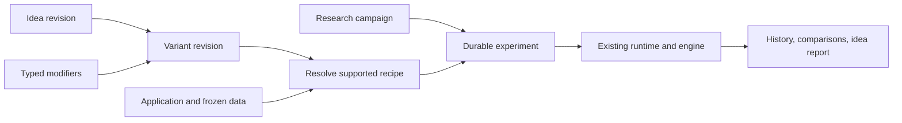

# Reusable trade ideas and controlled research

Status: proposed design, September 20, 2026. No new runtime capability is claimed.
The user has prioritized these research foundations before Jev Task 3.
Implementation is specified in the
[research foundation plan](plans/2026-09-20-trade-idea-research.md).

## Intent

An idea container is a documented thesis with a reusable strategy recipe and a
history of its variations and tests. The owner should be able to explain the
idea once, change one identifiable ingredient, apply it across different stocks,
and see exactly what was tested and learned.

Keep the user model simple: an idea card, categorized variations, applications,
and results. The underlying records separate those concepts to prevent a change
of stock, assumption, or historical period from silently changing the thesis.
BKTSTR remains independent of the Bailey Fund.

## Assessment and alternatives

This fits the existing architecture and the user's minute-to-hour research goals.
The missing layer is a durable research organization and evaluation contract above
the existing strategy compiler, engine, and experiment store.

| Approach | Benefit | Limitation |
| --- | --- | --- |
| Folders of idea notes and copied strategy JSON | Quick to author | Copies drift; ancestry, attempts, and controlled comparisons are difficult to enforce |
| Versioned idea records with typed modifiers and late-bound inputs | Reusable, inspectable, and compatible with today's compiler | Requires catalog, resolution, and protocol integration |
| A universal strategy programming language and plugin marketplace | Broad eventual expressiveness | Large new execution surface before basic research workflow is complete |

Use versioned idea records. Store structured JSON as the source of truth and
generate a readable idea card. Narrative explains the mechanism; executable fields
use registered components. Prose is never silently treated as executable logic.

## Reusable does not mean universally valid

The container format is independent of asset names, sectors, macro narratives,
and particular datasets. A recipe names input roles and requirements, such as
subject, benchmark, bar frequency, measurement units, and supported execution.
A separate application binds those roles to actual instruments and data.

The first executable scope remains equity/ETF minute bars. Futures, options, crypto,
and other domains require suitable data, units, calendars, sizing, and execution
adapters. Storing their ideas does not establish runtime support. Validation rejects
unsupported applications before acquiring market or model data.

Prefer portable quantities such as percentages, ratios, and normalized volume when
the theory permits them. A fixed-dollar threshold is allowed but must declare its
units and applicability. Do not silently rescale rules to make a new stock fit.
Results remain specific to their tested instruments and conditions. Transferability
is a research question, not a property conferred by the container format.

## User-facing hierarchy

```text
Idea: continuation after a VWAP reclaim
  Thesis and disproof criteria
  Base recipe
  Variations
    Entry confirmation
    Technical / stock filters
    Market / benchmark context
    Macro assumptions and evidence
    Timing
    Risk and exits
    Execution-cost sensitivity
    Explicit combinations
  Applications: instruments, market profile, dataset
  Research campaigns: baseline, candidates, periods, attempt budget
  Results, limitations, and conclusions
```

Categories organize variations; they do not create hidden inheritance. Every
variant has one explicit parent revision and a complete resolved recipe. Reusable
modifiers can be combined explicitly. Their order is fixed, their versions are
pinned, and conflicting assignments fail rather than allowing last-write-wins.
Display the effective differences against both parent and baseline.

Changing the central explanatory mechanism creates a related idea, with a
`derived_from` link. Adjusting its trigger, filters, timing, or exits creates a
variant. The author makes that semantic distinction and records the reason; the
software does not pretend it can determine whether two narratives mean the same
thing. Numerical and prose revisions remain immutable and addressable.

## Records and ownership

| Record | Owns | Does not own |
| --- | --- | --- |
| Idea revision | ID/version, title, thesis, mechanism, falsification, applicability, input roles, base recipe, related-idea links | Actual ticker choices, run dates, observed performance |
| Modifier revision | ID/version, category, rationale, typed changes, prerequisites, conflicts, evidence requirement | Arbitrary code or silent symbol-specific overrides |
| Variant revision | Idea revision, parent, ordered modifier revisions, change rationale, resolved recipe digest | A moving reference to latest definitions |
| Application | Role-to-instrument bindings, domain profile, currency, calendar, timezone, timeframe, dataset/evidence references | Undocumented changes to recipe logic |
| Research campaign | Frozen baseline/candidates, application matrix, split rules, metrics, attempt budget, stopping and comparison rules | A candidate list rewritten after seeing final results |
| Experiment and attempt | Exact resolved manifest, inputs, software/execution identities, lifecycle, artifacts, metrics and lineage | A replacement for the thesis or protocol |
| Assessment event | Author, timestamp, linked results, conclusion, limitations, promotion/rejection reason | Overwriting inconvenient earlier conclusions |

Container status and empirical support are separate. A well-formed recipe can be
untested, inconclusive, rejected, or supported within a stated sample. No status
means automatically approved for live trading.

## Macro assumptions

Each macro item records its claim, observable proxy or question, required units,
availability/freshness rules, and one of these modes:

- `evidence_required`: evaluate only with eligible point-in-time source records.
- `scenario_only`: a deliberately hypothetical condition, visibly non-canonical
  and excluded from confirmatory comparison or promotion.
- `unavailable`: the required adapter, history, or evaluator does not exist.

The base recipe can run without an optional macro variant. A selected macro
variant cannot silently fall back to the base recipe. Missing implementation or
data creates an inspectable blocked attempt. Do not turn planned assumptions into
active gates through labels or narrative.

Before Task 3, only the already implemented numerical technical/regime variants
execute. Macro concepts can be documented and linked to immutable evidence, but
active macro gates still await the shared evaluator. Scenario execution also
requires an explicitly supported evaluator; its label alone does not enable it.
The existing BLS CPI adapter remains prospective-only. Recorded evidence is not
proof that an engine consumed it; provenance must distinguish attached references
from consumed inputs.

## Durable research workflow



Use the existing experiment database and worker. Add catalog and protocol records
alongside experiments rather than introducing another execution engine. Persist
the resolved manifest before execution. Every configured run receives an experiment
ID and links back to an idea, variant, application, and campaign when supplied.
Existing baseline endpoints retain their contracts.

Exact replay pins immutable source/derived artifacts and formula/build identities;
matching ticker and dates or merely hitting the current cache is insufficient.
A missing or corrupt pinned artifact blocks replay. A fresh provider download is
an explicit new acquisition and may change the dataset identity.

## Controlled comparisons

Freeze a campaign before its first run. It declares:

- The baseline and candidate variant revisions, permitted differences, and the
  instruments/universe selected before inspecting results.
- Chronological development, validation, and final periods, including warm-up
  permissions and boundary handling. Warm-up may initialize indicators from the
  past but cannot contribute scored trades. A position cannot cross a scored split.
- A primary score, minimum sample requirements, secondary diagnostics, and stopping
  rules. Current metrics retain their present definitions and limitations.
- Distinct-candidate and execution-attempt budgets, plus rules for retries and
  deliberate replication. Count all admitted attempts, not just winners.

Default to one changed factor at a time. Explicit combination variants are allowed,
but reports distinguish a combined effect from attribution to one modifier.
Control data, instrument bindings, periods, execution version, costs, and other
settings within each comparison cell. Cost/risk sensitivity tests must explicitly
declare those as the changed factor and appear in their own comparison panels.

Applying the same recipe to another stock creates another application. Compare
baseline versus variant on each stock first. Then report the predeclared universe
with per-stock results and a declared aggregation rule. Do not hide dispersion or
select only stocks that worked. Independent symbol tests are not shared-account
portfolio simulations.

Validation can inform selection, but every such inspection is recorded. Freeze
the final candidate before final evaluation. Revealing final metrics creates an
append-only exposure event. Reuse is labeled reused/contaminated, and cannot be
advertised as an untouched test by renaming an idea or creating a new campaign.
The exposure ledger checks overlapping instrument/data/time scopes across the
local research archive. External/manual inspection requires an explicit disclosure;
software cannot guarantee that a person has never seen market outcomes elsewhere.

Attempt reservation, budget admission, stable child identity, and queue creation
must be transactionally consistent. A restart resumes/reconciles the same logical
attempt; a new idempotency key cannot manufacture a new pristine final test.
Failed, blocked, canceled, zero-trade, and inconclusive outcomes stay visible.

## Completion gate before Jev

A fixture demonstration must create one idea, resolve a base and two numerical
variants, apply them to two stocks, run controlled comparisons on frozen data,
survive a restart without duplicating completed work, and retrieve a readable
idea report containing every attempt and an exact offline replay.

It must reject an incompatible binding, conflicting modifiers, an unavailable
macro gate, an exhausted budget, mismatched comparison inputs, and a reused final
period claimed as untouched. A changed modifier creates a new revision while old
results remain reproducible. This closes the two prioritized structural gaps
without depending on Jev, a broker, or improved fill economics.
